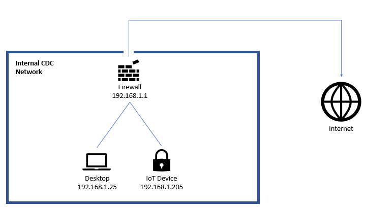

# Virtual Machines
We have provided Virtual Machines that can be imported directly into VirtualBox. 

Begin Here

----------------

Download the latest [VirtualBox](https://www.virtualbox.org/wiki/Downloads) for your computer. For example, If you are using a Windows computer, download the file named "Windows hosts." VirtualBox is an application that lets you run mini computers, or "Virtual Machines", on your computer. 

Network Diagram

-----------------------

The three virtual machines are configured as seen below. 

Import "pfSense.ova" into VirtualBox

-------------------------------------------

1. Download the pfSense.ova file to your computer

2. Open VirtualBox on your computer

3. Inside VirtualBox, click  "File" --> "Import Appliance"  located in the upper left-hand corner

4. Click the orange Folder icon on the right hand side of the screen

5. Browse for the location of the file named "pfSense.ova" 

6. Once you have selected the correct file, click "Next" towards the bototm of the screen

7. For "MAC Address Policy" select "Generate new MAC addresses for all network adapters" from the dropdown menu near the bototm

8. Select "Import"

9. Select the VM named "pfSense" and click the green arrow titled "Show". This will power on your virtual machine.

10. Wait five minutes for pfSense to finish loading. 

11. Eventually you will be prompted with the home screen for pfSense. Type "7" and hit enter

12. Type "youtube.com" and hit enter

13. Verify that you have "0.0% packet loss"

14. You have sucessfully configured pfSense

